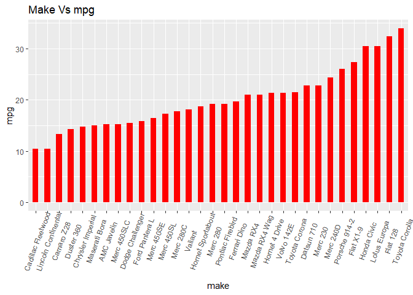
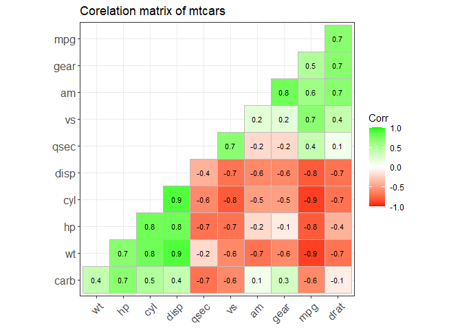
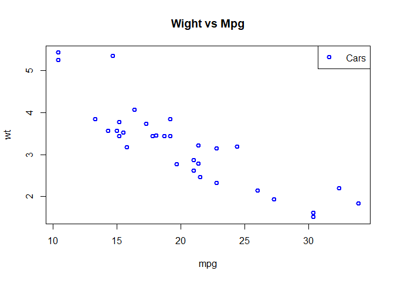
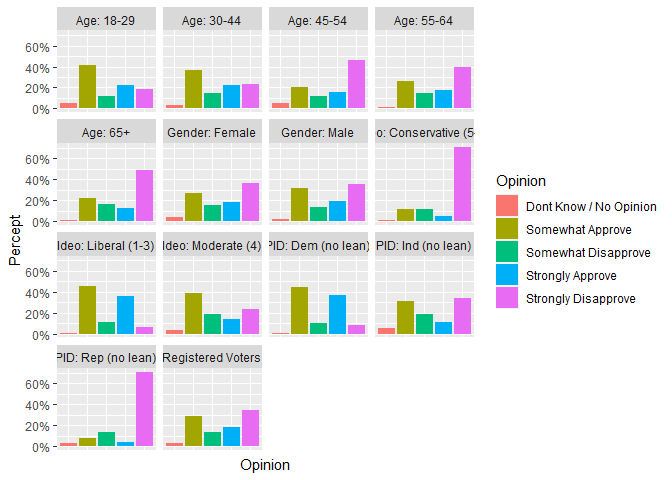

    rm(list=ls()) #rm(list of objects) removes all objects from memory
    graphics.off() #Closing all previously open graphs

    library(tidyverse)
    library(lubridate)
    library(dplyr)
    library("data.table")
    library(readr)
    library(car)
    library(readxl)
    library(mice)
    library(gapminder)
    library(here)
    library(ggplot2)
    #library(ggplot)

    mtcars <- read_csv("C:/Users/Admin/Downloads/mtcars.csv")

    ## Rows: 32 Columns: 12
    ## -- Column specification --------------------------------------------------------
    ## Delimiter: ","
    ## chr  (1): make
    ## dbl (11): mpg, cyl, disp, hp, drat, wt, qsec, vs, am, gear, carb
    ## 
    ## i Use `spec()` to retrieve the full column specification for this data.
    ## i Specify the column types or set `show_col_types = FALSE` to quiet this message.

    ggplot(mtcars, aes(x=make, y=mpg)) + 
      geom_bar(aes(reorder(make,mpg),mpg),stat="identity", width=.5, fill="Red") + 
      labs(title="Make Vs mpg") + 
      theme(axis.text.x = element_text(angle=70, vjust=0.6))

The graphic above shows cars make and their mpg. The top 5 cars that get
the best MPG are Toyota Corolla, Fiat 128, lotus Europa, Honda civic,
and the FiatX1\_9. The cars with the lowest MPG in the data set are
Chrysler Imperial, Duster 360, Camaro Z28, and Lincoln Continental and
the last with the worst MPG is the Cadillac Fleetwood.

    #importing packages

    library(ggcorrplot)
    library(ggthemes)

    # Correlation matrix
    data(mtcars)
    corr <- round(cor(mtcars), 1)

    # Ploting Corelation matrix of mtcars
    ggcorrplot(corr, hc.order = TRUE, 
               type = "lower", 
               lab = TRUE, 
               lab_size = 3, 
               colors = c("red", "white", "green"), 
               title="Corelation matrix of mtcars", 
               ggtheme=theme_bw)

This heat map represent the relationship between different features of
the car.For example we can see that a cars weight is negatively
correlated with MPG at -.9 this can be seen in the graphic on the bottom
right hand Conner.

lets run a regression

In this model, I use an OLS analysis technique to understand the
relationship between a car’s weight and the MPG that it gets on average
when driving on the freeway. My null hypothesis is that a car’s weight
will negatively affect its mpg.

    model<- lm(mpg~wt,data = mtcars)
    summary(model)

    ## 
    ## Call:
    ## lm(formula = mpg ~ wt, data = mtcars)
    ## 
    ## Residuals:
    ##     Min      1Q  Median      3Q     Max 
    ## -4.5432 -2.3647 -0.1252  1.4096  6.8727 
    ## 
    ## Coefficients:
    ##             Estimate Std. Error t value Pr(>|t|)    
    ## (Intercept)  37.2851     1.8776  19.858  < 2e-16 ***
    ## wt           -5.3445     0.5591  -9.559 1.29e-10 ***
    ## ---
    ## Signif. codes:  0 '***' 0.001 '**' 0.01 '*' 0.05 '.' 0.1 ' ' 1
    ## 
    ## Residual standard error: 3.046 on 30 degrees of freedom
    ## Multiple R-squared:  0.7528, Adjusted R-squared:  0.7446 
    ## F-statistic: 91.38 on 1 and 30 DF,  p-value: 1.294e-10

    plot(wt~mpg, data=mtcars, main="Wight vs Mpg", col="blue",lwd=2)
    legend("topright", legend = c("Cars"),
           col=c("blue","red"), lty=c(0,1), pch=c(1,NA),lwd=2)

In the regression results, we can see with a car’s weight of 0 the mpg
is stated to be 37 miles per gallon the intercept rarely makes any
sense, therefore, we will leave it at that and use it as a starting
point. When we analyze the coefficient estimates results for the weight
of a car, we can see that it has a negative relationship with miles per
gallon the P-value on this coefficient reaches the highest level of
significance which allows us to confirm that this variable does have
significance within our model. when we look at the coefficient estimates
results, we can see that with every one unit increase in a car weight we
should see a fall in a cars MPG by 5.34 miles. When looking at the r ^2
of this model we can see that it encompasses about 75% of the variation
inside this data set. In this is a simple regression model we can assume
that there might be omitted variable bias hiding inside of the error
term as we include more variables into our model will be able to paint a
better picture of what contributes to a car’s miles per gallon.

Cleaning the environment for new Data

    rm(list=ls()) #rm(list of objects) removes all objects from memory
    graphics.off() #Closing all previously open graphs

Part 2 data ViZ

    viz <- read_csv("C:/Users/Admin/OneDrive/Desktop/morning conslut/part 2 data.csv")

    ## Rows: 42 Columns: 6
    ## -- Column specification --------------------------------------------------------
    ## Delimiter: ","
    ## chr (1): Demographic
    ## dbl (5): Strongly Approve, Somewhat Approve, Somewhat Disapprove, Strongly D...
    ## 
    ## i Use `spec()` to retrieve the full column specification for this data.
    ## i Specify the column types or set `show_col_types = FALSE` to quiet this message.

Cleaning up the data

    viz <- viz %>% na.omit()

    View(viz)
    sapply(viz,class)

    ##            Demographic       Strongly Approve       Somewhat Approve 
    ##            "character"              "numeric"              "numeric" 
    ##    Somewhat Disapprove    Strongly Disapprove Dont Know / No Opinion 
    ##              "numeric"              "numeric"              "numeric"

Recreating the data Viz

    a<- viz %>% pivot_longer(-Demographic) 
    a %>% group_by(Demographic)%>% mutate(pvalue = round(value/sum(value),2)) %>% ungroup() %>%
    ggplot(aes(y = pvalue, x = name, fill = name))+ geom_col() + facet_wrap(~Demographic) +
    scale_y_continuous(labels = scales::percent_format(accuracy = 1))+
    theme(axis.text.x = element_blank(), axis.ticks.x = element_blank())+
      labs( x = "Opinion", y = "Percept", fill = "Opinion")

