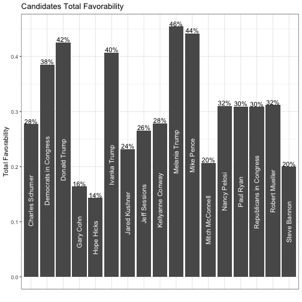
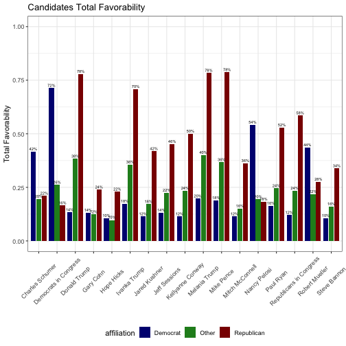
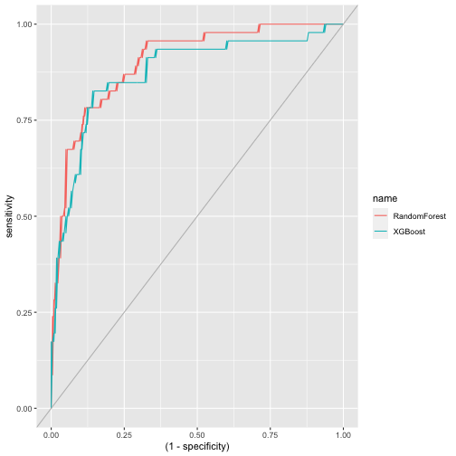

Individual Ratings -- please calculate the following for each of the 17 figures and export it to a csv. Please use tidy data techniques to create the summaries. Please also include your associated R files:
a. Net favorability: % favorable (very favorable + somewhat favorable) minus % unfavorable (somewhat unfavorable + very unfavorable)
b. Favorability ratio: % favorable (either very favorable or somewhat favorable) divided by % unfavorable (either somewhat unfavorable or very unfavorable)
c. Total Favorability: % very favorable + % somewhat favorable

Please create a figure in R (ideally using ggplot2) displaying Total Favorability for the 17 individuals. The plots will be evaluated on accuracy and readability / appearance.




Please create another figure in R displaying favorability among Democrats and Republicans among the 17 individuals. The plots will be evaluated on accuracy and readability / appearance.


Develop a statistical model predicting whether Americans have a favorable or unfavorable view of Donald Trump (variable indPresApp_11). You have free range over variable selection and model type. Briefly describe your findings, your model, and why you chose your model in 2-3 paragraphs.




```
## # A tibble: 2 × 3
##   .metric     rf   xgb
##   <chr>    <dbl> <dbl>
## 1 accuracy 0.826 0.826
## 2 roc_auc  0.902 0.873
```


